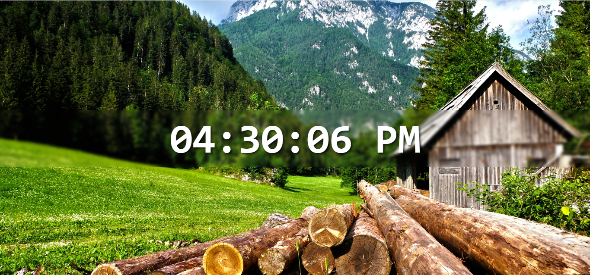

# Digital Clock

A simple digital clock built with React that displays the current time, updated every second. The clock is styled with a custom background and provides a clean, user-friendly UI.

## 🌐 Live Demo

[View the live project here!](https://laibatariq110.github.io/React-Digital-Clock-Program)


## Features

- **Real-time clock** that updates every second.
- **12-hour format** with AM/PM notation.
- Styled with CSS for a sleek, modern look.

## Components

- **App**: The main component that renders the `DigitalClock` component.
- **DigitalClock**: Displays the current time, updating every second.

## Project Structure

- **App.jsx**: The main component file that imports and renders DigitalClock. 
- **DigitalClock.jsx**: The clock component that manages time state and format.
- **index.css**: Contains styles for the clock, including background image and text formatting.

## Customization

- **Background Image**: Replace assets/background.jpg with your preferred image for a personalized look.
- **Font and Colors**: Customize the font style, size, and colors in index.css for a unique design.

## Code Explanation

- **useState**: Manages the current time as a state.
- **useEffect**:  Sets up a timer to update the time every second.
- **formatTime()**: Converts the time to a 12-hour format with zero-padding.
- **padZero()**:  Adds a leading zero to single-digit hours, minutes, or seconds for uniformity.
  
## Setup

``` bash
# Clone the repository
git clone https://github.com/your-username/your-repository-name.git
cd your-repository-name

# Install dependencies
npm install

# Run the app
npm start 

This will start the app in development mode, usually available at http://localhost:3000 
```
## License

This project is open-source and available under the MIT License.
